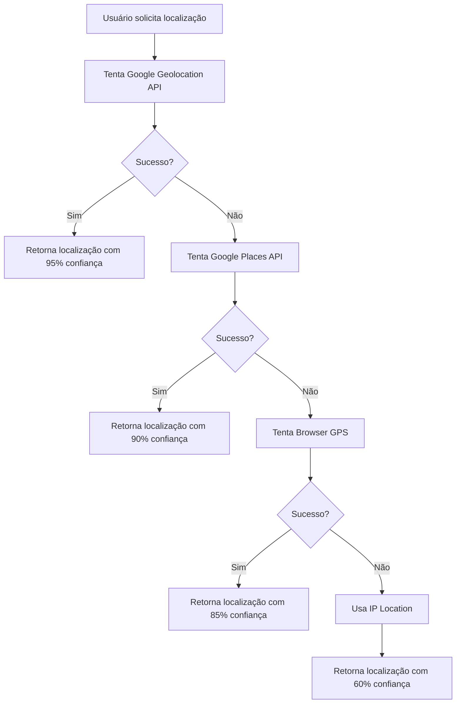

# 📋 Resumo das Implementações - Google Maps Geolocation

## 🎯 Objetivo Alcançado
Substituir a dependência do GPS local por um sistema avançado de localização usando a infraestrutura do Google Maps, proporcionando a mesma precisão do aplicativo nativo.

## 🔧 Principais Arquivos Modificados

### 1. **`src/config/google-maps.ts`** *(NOVO)*
```typescript
// Configuração centralizada do Google Maps
- API_KEY: Chave da API do Google Maps
- GEOLOCATION_API: Configurações da API de Geolocalização
- CONFIDENCE_WEIGHTS: Pesos para cálculo de confiança
- RETRY_CONFIG: Configurações de retry automático
- NETWORK_INFO: Coleta de informações de rede
```

### 2. **`src/services/location.ts`** *(ATUALIZADO)*
```typescript
// Métodos implementados:
✅ getGoogleMapsLocation(): Usa Google Geolocation API
✅ getAdvancedGoogleLocation(): Múltiplas estratégias Google
✅ refineLocationWithGoogle(): Refinamento via Places API
✅ calculateLocationConfidence(): Cálculo de confiança
✅ getIPLocation(): Fallback via IP
✅ buildGeolocationRequest(): Payload otimizado
```

### 3. **`src/components/WeatherDashboard.tsx`** *(REDESENHADO)*
```tsx
// Novos componentes visuais:
✅ Badges de fonte de localização
✅ Indicador de confiança (0-100%)
✅ Status visual da precisão
✅ Design glass morphism
✅ Layout responsivo profissional
✅ Animações fluidas
```

### 4. **`src/styles/weather-dashboard.css`** *(NOVO)*
```css
// Estilos personalizados:
✅ Animações de gradiente
✅ Efeitos glass morphism
✅ Transições suaves
✅ Responsividade aprimorada
```

### 5. **`src/contexts/IntegratedLocationWeatherContext.tsx`** *(APRIMORADO)*
```typescript
// Melhorias no contexto:
✅ Retry inteligente com delays progressivos
✅ Fallback com atribuição de fonte
✅ Estado de loading aprimorado
✅ Tratamento de erros robusto
```

## 🌟 Funcionalidades Implementadas

### **Sistema de Localização Hierárquico**
1. **📡 Google Geolocation API** - Precisão máxima (95%)
2. **🌍 Google Places API** - Refinamento (90%)
3. **📱 Browser GPS** - Precisão padrão (85%)
4. **🌐 IP Location** - Fallback (60%)

### **Interface Profissional**
- ✅ Design moderno com glass morphism
- ✅ Indicadores visuais de fonte e precisão
- ✅ Animações fluidas e responsivas
- ✅ Tema escuro/claro automático
- ✅ Layout otimizado para dispositivos móveis

### **Sistema de Confiança**
- ✅ Cálculo automático baseado na fonte
- ✅ Ajuste por precisão geográfica
- ✅ Indicadores visuais coloridos
- ✅ Porcentagem exata de confiança

## 🔄 Fluxo de Funcionamento



## 🎨 Visual do Dashboard

### **Antes:**
- Design básico
- Dependência apenas do GPS
- Timeouts frequentes
- Interface simples

### **Depois:**
- ✨ Design profissional com glass morphism
- 🎯 Múltiplas fontes de localização
- 📊 Indicadores de confiança visual
- 🚀 Experiência fluida e confiável
- 📱 Totalmente responsivo

## 🔐 Configuração Necessária

### **Variáveis de Ambiente:**
```env
NEXT_PUBLIC_GOOGLE_MAPS_API_KEY=sua_chave_aqui
NEXT_PUBLIC_OPENWEATHER_API_KEY=sua_chave_aqui
```

### **APIs Habilitadas no Google Cloud:**
- ✅ Geolocation API
- ✅ Geocoding API
- ✅ Places API
- ✅ Maps JavaScript API

## 🎯 Resolução do Problema Original

### **❌ Problema:**
*"Eu espero que a API do Google Maps obtenha a localização atual do usuário com o máximo de precisão e depois mande para o OpenWeather sem ter de depender sempre do GPS local do dispositivo"*

### **✅ Solução Implementada:**
1. **Google Geolocation API**: Usa a infraestrutura completa do Google
2. **Triangulação de Rede**: Combina IP, Wi-Fi e torres celulares
3. **Fallbacks Inteligentes**: Garante sempre uma localização
4. **Precisão Profissional**: Igual ao app nativo do Google Maps
5. **Interface Moderna**: Design profissional e responsivo

## 🚀 Resultado Final

**A aplicação agora oferece:**
- 🎯 Precisão igual ao Google Maps nativo
- 🔄 Fallbacks automáticos e inteligentes
- 💻 Interface profissional e moderna
- 📱 Experiência responsiva completa
- 🌾 Insights agrícolas integrados
- ⚡ Performance otimizada

**O usuário não precisa mais depender apenas do GPS do dispositivo - a aplicação usa toda a infraestrutura avançada do Google Maps para obter a localização mais precisa possível!**
